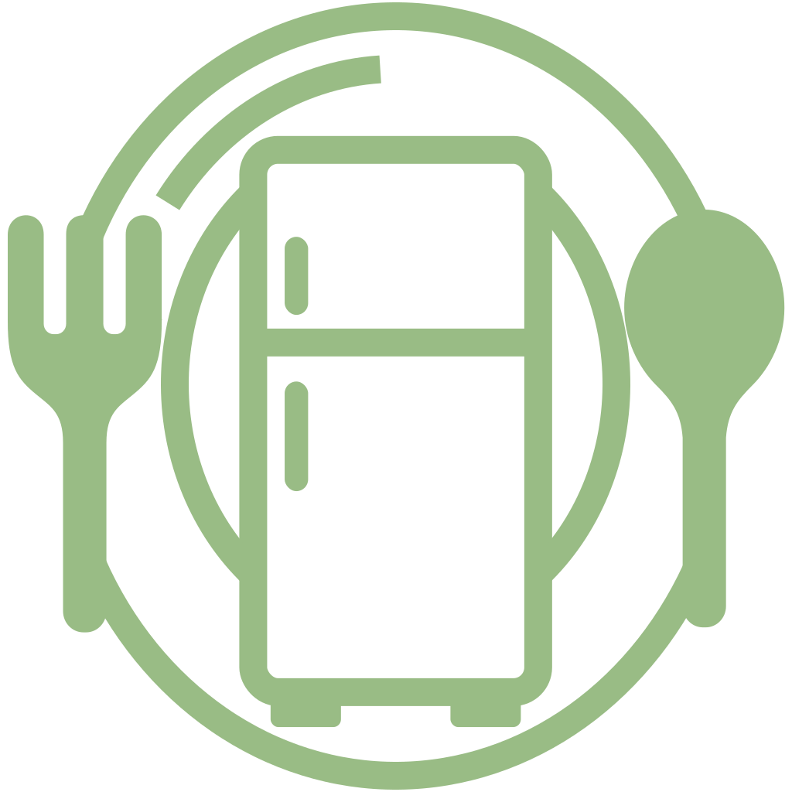

# Shomi

**Shomi** is a mobile application that helps users efficiently manage their pantry and cooking activities.

It allows users to:

- Track pantry inventory manually or by scanning barcodes.
- Get recipe recommendations based on pantry ingredients.
- Create and share custom recipes.
- Log when they "cook" a recipe, automatically deducting used ingredients.
- Maintain a shopping list for missing or expiring items.

---

## Tech Stack

- **React Native** (Expo) with **TypeScript**
- **Supabase** Authentication and Storage
- **Axios** for API requests
- **PostgreSQL** backend (via Supabase)

---

## Getting Started

**Prerequisites:**

- Node.js and npm installed
- Expo CLI installed globally (`npm install -g expo-cli`)
- Supabase project and environment variables configured

---

**Run the project locally:**

```bash
npx expo run:android
```

## Features

- Pantry management: add, edit, delete pantry items.
- Barcode scanning to update or add pantry items.
- Recipe recommendations based on current pantry ingredients.
- Create and manage your own recipes.
- Log cooked recipes to deduct ingredients.
- Shopping list generation based on missing or expiring items.

## Authentication

- Supabase authentication handles user login and registration.
- JWT tokens are used for securing all API requests.
- Sessions are managed through Supabase client.

## License

This project is private and intended for personal or educational use only.
Unauthorized copying, distribution, or commercial use is prohibited.
